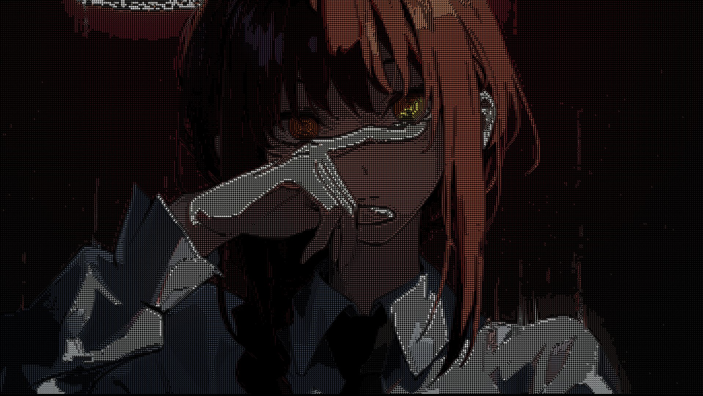

# asciify



**asciify** is a tool for converting images into ASCII art with added edge detection. It uses Go to transform images into ASCII representations, complete with customizable color palettes, edge-based symbol selection, and other stylistic options.

This project was inspired Acerola's excellent YouTube video on making shaders: [I Tried Turning Games into Text](https://www.youtube.com/watch?v=gg40RWiaHRY&t=917s). Massive thanks to Acerola for the inspiration, and hurricane Milton for finally spurring me to do this.

## Notes

Version 1.0.0 is released! `asciify` now has fully functioning bloom images done fast using the Stack Blur algorithm instead of the full, perfect Gaussian Blur. Current benchmarks:

- 6K image: 2.6s
- 2K image: 1.2s
- 1920 x 1280 (standard 1080p): 500ms

## Features

- [x] **Luminance based**: Converts any image into ASCII characters, strictly using the luminance value of a block of pixels.
- [x] **Color Support**: Choose between monochrome, inverted, or full-color outputs.
- [x] **Edge Detection**: Utilizes Sobel filter to perform edge detection to replace edge pixels with specific ASCII characters (`|`, `_`, `/`, `\`) to highlight contours.
- [x] **Difference-of-gaussians preprocessing**: Used as a preprocessing step to filter out extra variations and contours, leaving only the most pronounced one for the edge detection algorithm
- [x] **Effects suite**: Loaded with bloom, color burn, effects for more pronounced color processing.

## Installation

asciify now has a pre-built binary for Linux, which is also included in this repository. To use it, clone the repository and run the command:

```bash
git clone https://github.com/therealozp/asciify.git
./asciify
```

To build `asciify` yourself, clone the repository and build the tool:

```bash
git clone https://github.com/therealozp/asciify.git
cd asciify
go build
./asciify
```

## Usage

You can convert an image to ASCII art using the following command:

```bash
./asciify /path/to/image.png --output /path/to/output.png --monochrome --burn --bloom --thresh 235
```

an equivalent in binary flags would be

```bash
./asciify /path/to/image -m -r -b -t 235
```

### Command-Line Options

- `--input`: Path to the input image.
- `--output`: Path where the output ASCII art will be saved.
- `--scaleFactor`: Factor by which the original image is downscaled to generate ASCII output. Larger scale factors make the resulting image smaller.
- `--monochrome`: If true, output is monochrome. If false, retains original colors.
- `--bloom`: bloom effect picks the brightest parts of the image (defined by bloomThreshold argument) to highlight, making it act like a light source.
- `--burn`: exaggerates brighter colors.

## Contributing

Contributions are welcome! Feel free to open issues or submit pull requests for new features, improvements, or bug fixes.

## TODO

- [ ] **Customizable Characters**: Customize the ASCII characters used for different luminance levels and edges.
- [ ] **CRT Effect**: Plans for retro CRT filters and neon cyberpunk-inspired aesthetics.
- [ ] **Tone Mapping and Contrast**: Needs to make it sharper, more distinct from background, and apply other image processing techniques for better images.
